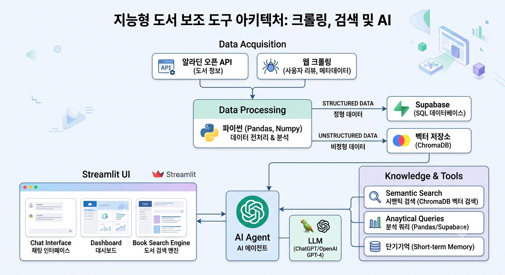
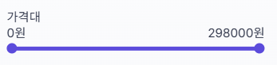
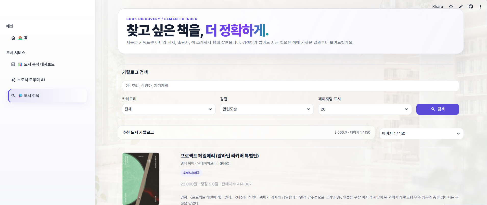

# 도서 데이터 기반 검색·분석·추천 웹 서비스

## 목차
1. 기획 배경
2. 프로젝트 개괄
3. 서비스 소개
4. 기술 스택
5. 프로젝트 소감

## 1. 기획배경
베스트셀러는 가장 많이 팔린 책을 의미하나, 소비자 개인이 선호하는 책과는 반드시 일치하지 않음. 이에 베스트셀러의 전체 경향과 데이터분석과를 제공하고, 소비자가 원하는 도서내용 등을 입력하면 도서를 추천하는 웹서비스를 개발하기로 하였음. 

## 2. 프로젝트 개괄

### 2-1 팀&역할

팀명: 라이브러리 헬퍼

송진명: 팀장, 데이터 수집, streamlit 구축 및 최적화.

김유건: RAG, 데이터 분석, README 작성.

이건호: RAG, 데이터 분석, 평가셋 구축.

홍기표: RAG, 에이전트 구축.

### 2-2 GRAND RULE

30분에 한번씩 뭐하고 있나 말하기

너무 AI에 의존하지 않기

어려우면 바로바로 서로 물어보면서 하기

너무 모르겠다 → ai 물어보기

팀원한테 먼저 물어보기

### 2-3 기간 및 기반 프로그램 등
프로젝트 기간: 2026년 8월 20일 ~ 8월 24일

기반프로그램: gpt-4o-mini, streamlit.

프로젝트 기간: 2026년 8월 20일 ~ 8월 24일

대상데이터: 베스트셀러 3000권. 알라딘의 각 15개 카테고리의 200권.

### 2-3 프로젝트 개요

## 2-2 서비스 소개
도서 분석 대시보드: 도서 데이터를 다양한 기준으로 탐색하고 시각화, 사용자가 필요한 정보를 쉽게 조회하고, 도서 데이터의 특징과 패턴을 효과적으로 파악.

도서도우미 AI: 사용자의 취향을 파악하여 베스트셀러 중에서 도서를 추천.

## 3. 서비스 소개

### 3-1. 도서 분석 대시보드

#### 3-1-1. 주요 기능 설명

사이드바의 탐색 설정을 통해 사용자가 원하는 도서를 필터링할 수 있도록 함.

 - 가격대: 바(bar)를 양쪽에서 조절하여 자유로운 설정 가능.

 - 최소평점: 평점이 낮거나 없는 도서를 배제 가능.
 
 - 차트에 표시할 순위: 인기 작가와 출판사를 몇 명까지 보여줄지 설정 가능.

웹페이지 상단에 카탈로그를 배치하여 도서 수, 작가 수, 출판사 수, 평균 평점을 배치하여 탐색설정에 따른 분석 개괄을 볼 수 있음.

카테고리별 가격, 인기작가, 주요 출판사로 탭을 나누어 간결한 인터페이스 구축.

#### 3-1-2. 도서 분석 대시보드 - 한계 및 문제점

일부 고가의 책들로 인해 대부분의 도서가 분포하는 10,000~20,000원 구간에서는 세밀한 조정이 어려움.

### 3-2. 도서도우미 AI

#### 3-2-1. 도서도우미 AI - 주요 기능 분석

RAG AI 에이전트 연동 및 메모리 관리

 - @st.cache_resource를 활용해 외부 모듈(agent/book_agent.py)의 도서 추천 에이전트 실행 함수(ask_book_agent_with_results)와 대화 초기화 함수(reset_book_memory)를 효율적으로 로드.

 - 사용자의 대화 흐름을 세션 고유 식별자(book_agent_thread_id)로 관리하여 멀티턴 대화 맥락을 유지.

대화형 인터페이스 및 사용자 경험 제공

 - st.chat_message 및 st.chat_input을 사용하여 카카오톡/챗GPT 형태의 실시간 대화 흐름을 구현.

 - 커스텀 프로필 이미지(ASSISTANT_AVATAR)를 배치하고, 대화 시작 시 사용자가 빠르게 시도할 수 있는 추천 질문 칩(st.pills)을 제공.

검색 결과 도서 카드 레이아웃 출력 (render_book_cards)

 - 에이전트가 추천한 도서 목록(books)을 한 줄에 3개씩 반응형 그리드(st.columns) 형태로 시각화.

 - 표지 이미지, 도서 제목, 저자, 가격(천 단위 콤마 적용), 평점 등의 메타데이터를 깔끔하게 표시.

 - st.expander를 사용해 추천 도서별 "검색 근거"를 접고 펼칠 수 있게 구성하여 결과의 신뢰성을 제고.

대화 초기화 및 새로고침 기능

 - 우측 상단의 "새 대화" 버튼 클릭 시 reset_chat()을 호출하여 백엔드 메모리를 리셋하고 새로운 스레드 ID를 생성.

 - 이전 메시지를 비우고 최초 안내 메시지로 대화창을 복구.

예외 처리 및 디버깅 가이드

 - API 연동 문제 발생 시 try-except 블록으로 예외를 포착하여 사용자 친화적인 에러 메시지를 노출.

 - 개발자를 위해 상세 오류 내용을 st.expander 내의 st.code로 확인할 수 있도록 처리.

## 3-2-2. 도서도우미 AI - 성능 검사

도서 추천 Agent의 검색 및 도구 사용 성능을 정형 검색과 의미검색으로 나누어 평가.

 - 주요 결과
    | 항목                        |                결과 |
    | ------------------------- | ----------------: |
    | Tool 선택 정확도               |          100% |
    | 정형 검색 Precision / Recall  | 97.2% / 97.2% |
    | 전체 Hit@K                  |         95.0% |
    | 전체 Precision@K / Recall@K | 70.6% / 70.6% |
    | 검색 결과 답변 반영률              |         94.5% |
    | 요청 K개 충족률                 |         93.3% |

- 평가 결과
    정형 검색 (search_book)
    
    가격, 평점, 카테고리, 저자 등 명확한 조건 검색은 매우 안정적으로 동작.

    복합 가격·평점 조건 평가에서도 반환 도서가 실제 DB 조건을 모두 만족.

    의미검색 (vector_search_descp)

    Agent의 Tool 선택은 정확했지만, 의미검색 Precision / Recall은 약 30% 수준으로 상대적으로 낮았음.

    직접 ChromaDB 검색에서도 비슷한 성능이 확인되어, 주요 병목은 Agent Routing보다 Embedding / Chroma Retrieval 품질에 있는 것으로 판단.

 ### 3-2-3. 한계 및 문제점

도서 추천 기능은 만족스러우나, 이전 데이터 저장 기능이 미흡하고 유사한 책을 추천하려고 함.

긴 응답대기시간.

## 3-3 도서 검색

데이터프레임을 이용한 도서 검색 기능 구현

## 4. 기술 스택

프론트엔드 : Bootstrap 5.3.0, AntDesign 5.0, React 5.0.1, NodeJS 18.13.0 LTS

백엔드 : Oracle Java 11.0.17, Spring boot 2.7.7, JPA, Swagger 2.9.2, python 3.8.0, MySQL 8.0.31

CI/CD: Jenkins, Docker, AWS ec2

IoT : Arduino 2.0.3

이슈관리 : Jira, Notion

분석 : pandas,matplotlib

임베딩·벡터DB : OpenAI Embeddings, ChromaDB

LLM : GPT + LangChain, RDBS

화면·배포 : Streamlit Cloud

협업 : GitHub (PR), Notion, FigJam

##  5. 프로젝트 소감

송진명(https://github.com/sjinm1222): 처음 프로젝트를 시작할 때는 계획한 대로 진행될 것이라고 생각했지만, 실제로 진행해 보니 예상대로 되지 않는 부분이 많았습니다. 특히 각자의 의견을 조율하고 역할을 나누는 과정에서 협업이 생각보다 어렵다는 것을 느꼈습니다. 개발 과정에서도 계획했던 기능이 제대로 구현되지 않거나 수정해야 하는 부분이 생기면서 시행착오를 많이 겪었습니다. 하지만 팀원들과 함께 하나씩 문제를 해결하고, 마지막에 실제 결과물이 완성되는 모습을 보면서 큰 뿌듯함을 느낄 수 있었습니다. 이번 프로젝트를 통해 결과물뿐만 아니라 협업 과정과 문제를 해결해 나가는 경험 자체도 중요하다는 것을 배울 수 있었습니다.

김유건(https://github.com/youkun119-netizen): 처음에는 막막했으나 팀원들과 협업하는 과정을 거쳐서 에러 발생에 대해 조바심을 내기보다는 차근차근 문제를 해결해가는 태도를 함양할 수 있었습니다. 팀원들에게 감사를 표합니다.

이건호(https://github.com/geeeeeonho): 여태까지 배웠던 것을 종합해 사용하면서, 전체 에이전트 구성 과정과 그 내부에 실제 작동에 대해서 깊게 생각해볼 수 있었습니다.
또한 전체 프로세스를 진행하면서 취약하거나 부족한 부분에 대해서도 확인해볼 수 있었습니다.

홍기표(https://github.com/gipyohong): AI를 활용한 RAG 구현이 모두에게 처음이었지만, 다 같이 열심히 노력한 덕분에 괜찮은 결과를 도출할 수 있어서 좋았던 것 같습니다. 또한 프로젝트를 진행하면서 배운 내용을 다시 한 번 복습할 수 있는 시간이 되어 좋았습니다.